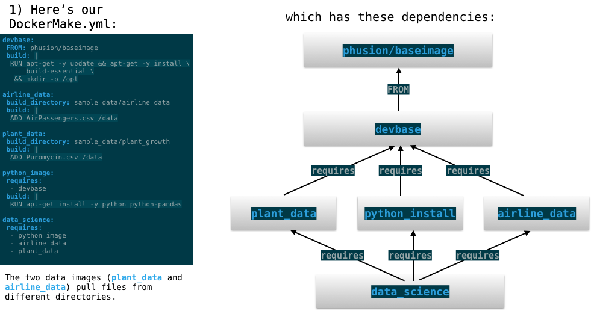
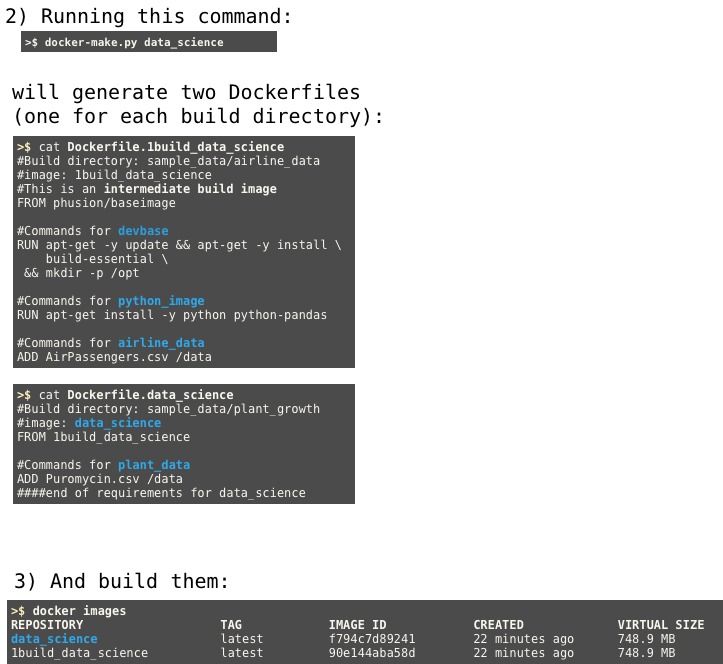

# Docker-make
[](https://app.codeship.com/projects/382713)
[ ](https://badge.fury.io/py/DockerMake)

## Table of Contents
+ [What is it?](#what-is-it)
+ [Install it](#install-it)
+ [Run it](#run-it)
+ [What you can do with it](#what-you-can-do-with-it)
    * [Build automation](#build-automation)
    * [Secrets and squashing](#secrets-and-squashing)
    * [File handling](#file-handling)
    * [Cache control](#cache-control)
+ [How to write DockerMake.yml](#how-to-write-dockermakeyml)
  - [Defining an image](#defining-an-image)
  - [Image definition reference](#image-definition-reference)
  - [Special fields](#special-fields)
  - [Notes](#notes-on-dockermake.yml)
+ [Example](#example)
+ [Command line usage](#command-line-usage)

## What is it?
A command line tool to build and manage stacks of docker images. You can mix and match different sets of build instructions as a dependency graph to create maintainable and extensible stacks of docker images.


## Install it

Requires [Docker](https://www.docker.com/products/docker) and Python 2.7 or 3.5+.

```
pip install DockerMake 
```

This will install the command line tool, `docker-make`, and its supporting python package, which you can import as `import dockermake`. 


## Run it

To build some illustrative examples, try running the example in this repository:

```bash
git clone https://github.com/avirshup/DockerMake
cd DockerMake/example
docker-make --list
docker-make final
```


## What you can do with it

The punchline: define small pieces of configuration or functionality, then mix them together into production container images.

#### Build steps
A `DockerMake.yml` file contains discrete build "steps". These steps can depend on each other, forming a dependency graph. DockerMake solves the dependency graph and drives building of each image as necessary. This makes it easy to keep your images up-to-date while still taking advantage of docker's shared fileystem layers and build cache.

#### Build automation
 * **new**: beta support for dockerfile build arguments
 * **new**: specify custom `.dockerignore` files for any given build step
 * Automated registry login and image pushes
 
#### Secrets and squashing
 - [squash](#squash) arbitrary parts of your build (using `squash: true` in a step definition) without busting the cache
 - Designate [`secret_files`](#secret_files) to erase them from intermediate layers (In the step definition, use `secret_files: ['path1', 'path2', ...]`)
 
**WARNING:** these features are in alpha - use with extreme caution
 
#### File handling
 * Create builds that ADD or COPY files from anywhere on your file system
 * Build artifacts in one image, then copy them into smaller images for deployment

#### Cache control
 - Invalidate docker's build cache at a specific step in the build using `--bust-cache [stepname]`
 - **new**: Use specific images to [resolve docker's build cache](https://github.com/moby/moby/issues/26065) (using `--cache-repo [repo]` and/or `--cache-tag [tag]`)
 - Force a clean rebuild without using the cache (using `--no-cache`)
 
 
## How to write DockerMake.yml
DockerMake.yml lets you split your image build up into discrete, easy to manage _steps_ that can be mixed together (as a dependency graph) to produce your desired container image.

### Defining an image

The DockerMake.yml file is a YAML-formatted file that lists build _steps_. To create an extremely basic image, define a step with a base image and a series of dockerfile commands:

```yaml
FIRST_STEP_NAME:
  FROM: BASE_IMAGE_NAME
  build: |
    RUN [something]
    ADD [something else]
    [Dockerfile commands go here]
```

Use the `requires` field to define additional steps that extend the first one:

```yaml
FIRST_STEP_NAME:
   [...]

NEXT_STEP_NAME:
   requires:
     - FIRST_STEP_NAME
   build: |
     [additional Dockerfile instructions]
```

### Image definition reference
Image definitions can include any of the following fields:

* [**`FROM`/`FROM_DOCKERFILE`**](#fromfrom_dockerfile)
* [**`build`**](#build)
* [**`requires`**](#requires)
* [**`build_directory`**](#build_directory)
* [**`ignore`/`ignorefile`**](#ignoreignorefile)
* [**`description`**](#description)
* [**`copy_from`**](#copy_from)
* [**`squash`**](#squash)
* [**`secret_files`**](#secret_files)

#### **`FROM`/`FROM_DOCKERFILE`**
The docker image to use as a base for this image (and those that require it). This can be either the name of an image (using `FROM`) or the path to a local Dockerfile (using `FROM_DOCKERFILE`).

*Example:*
```yaml
baseimage:
   FROM: python:3.6-slim
```
or
```yaml
baseimage:
   FROM_DOCKERFILE: ../myproject/Dockerfile
   ```
#### **`build`**
Multi-line string defining dockerfile commands to build this step. Note that these commands CANNOT contain 'FROM'. See also [Notes on multi-line strings](#Notes) below.

*Example:*
```yaml
build-image:
   requires:
     - baseimage
   build: |
     RUN apt-get update \
      && apt-get install -y gcc vi
     ENV editor=vi
```

#### **`requires`**
List of other image definitions to include in this one. `docker-make` will create a new image from a single DockerFile that includes an amalgamation of all image definitions.

*Example:*
 ```yaml
 my-tools:
   build: |
     RUN pip install numpy jupyter pandas
     [...]

 data-sci-environment:
    requires:
      - baseimage
      - my-tools
 ```

#### **`build_directory`**
Path to a directory on your filesystem. This will be used to locate files for `ADD` and `COPY` commands in your dockerfile. See [Notes on relative paths](#Notes) below.

*Example:*
```yaml
data-image:
    build_directory: ./datafiles
    build: |
      COPY data /opt/data
    [...]
```

#### **`ignore`/`ignorefile`**
A custom [.dockerignore](https://docs.docker.com/engine/reference/builder/#dockerignore-file) for this step. This overrides any existing `.dockerignore` file in the build context. Only relevant for `ADD` or `COPY` commands when the `build_directory` is specified. This can either be a multi-line string (using the `ignore` field)  or the path to a file (using the `ignorefile` field).

*Example:*
```yaml
data-image:
    build_directory: ./datafiles
    build: |
      ADD [...]
    ignore: |
      *.pyc
      *~
      *.tmp
```
  
#### **`description`**
An arbitrary comment (ignored by `docker-make`)

#### **`copy_from`**
Used to copy files into this image _from other images_ (to copy from your filesystem or a URL, use the standard `ADD` and `COPY` dockerfile commands). This is a mapping of mappings of the form:
```yaml
[image-name]:
   [...]
   copy_from:
     [source_image1]:
        [source path 1]: [dest path 1]
        [source path 2]: [dest path 2]
     [source image2]:
        [...]
```

Note that, for historical reasons, these copies are performed _after_ any _build_ instructions are executed.

#### **`squash`**
**NOTE**: this feature requires that your [docker daemon's experimental features be enabled.](https://github.com/docker/docker-ce/blob/master/components/cli/experimental/README.md)

Used to squash all layers produced in a given step. This can be helfpul both for keeping image sizes low, especially when it's necessary to add a lot of data via the `ADD` or `COPY` dockerfile commands.

Note that setting `squash: True` for a step only squashes the layers generated by that step. All layers in the base image are left intact.

Additionally, unlike the vanilla `docker build --squash` command, downstream image builds can use the squashed image in their cache, so that squashing doesn't force you to repeatedly re-run the same downstream build steps.

*Example:*
In this example, we create a huge file in the image, do something with it, then erase it. 

```yaml
count-a-big-file:
    FROM: alpine
    build: |
        RUN dd if=/dev/zero of=/root/bigfile count=16384 bs=1024
        RUN wc /root/bigfile > /root/numbiglines
        RUN rm /root/bigfile
```

Let's build it and check the size:
```bash
$ docker-make count-a-big-file
[...]
docker-make finished.
Built: 
 * count-a-big-file
$ docker images count-a-big-file
REPOSITORY         ...   SIZE
count-a-big-file   ...   20.9MB
```

But, take them same definition and add a `squash: true` to it:
```yaml
count-a-big-file:
    FROM: alpine
    squash: true
    build: |
        RUN dd if=/dev/zero of=/root/bigfile count=16384 bs=1024
        RUN wc /root/bigfile > /root/numbiglines
        RUN rm /root/bigfile
```
  
And we find that the deleted file is no longer taking up space:  
```bash
$ docker-make count-a-big-file
[...]
docker-make finished.
Built: 
 * count-a-big-file
$ docker images count-a-big-file
REPOSITORY         ...   SIZE
count-a-big-file   ...   4.15MB
```


#### **`secret_files`**
**Read these caveats first**

 - This is an alpha-stage feature. DO NOT rely on it as a security tool. You must carefully verify that your final image, and all its layers AND its history, are free of sensitive information before deploying or publishing them.
 - It relies on [experimental docker daemon features](https://github.com/docker/docker-ce/blob/master/components/cli/experimental/README.md).
 - Although your final image won't contain your secrets, they will be present in intermediate images on your build machine. Your secrets will be exposed to all `docker` users on your build machine.
 - When you define `secret_files` for a step, it only erases files that are added in the `build` definition _for that step_. Files added in other steps will remain exposed in your image's layers. 

**Background**

It's often necessary to perform some form of authentication during a build - for instance, you might need to clone a private git repository or download dependencies from a private server. However, it's quite challenging to do so without leaving your credentials inside a layer of the final docker image or its history.

Files added or created in a given step can be designated as `secret_files` in DockerMake.yml. These files will be automatically erased at the end of the step, and the step's layers will be squashed to keep the files out of the history.
 
 **Example**
```yaml
my-secret-steps:
    FROM: python:3.6
    build: |
        ADD my-credentials /opt/credentials
        RUN some-process --credentials /opt/credentials
    secret_files:
        - /opt/credentials
```

### Special fields

#### `_SOURCES_`

You can include step definitions from other DockerMake.yml files by listing them in the `_SOURCES_`. For example:

```yaml
_SOURCES_:
  - ~/mydefinitions/DockerMake.yml
  - ./other/file.yml
  [...]
```

Please note that relative file paths in each file are always interpreted _relative to the directory containing that file_.

#### `_ALL_`

By default, running `docker-make --all` will build all well-defined images defined in a file (and any files included via `_SOURCES_`). Images without a `FROM` or `FROM_DOCKERFILE` field in any of their requirements will be ignored.

Alternatively, you can use the `_ALL_` field to designate specific images to build. For example, in the following definition, `docker-make --all` will only build `imgone` and `imgtwo`, not `baseimage`: 

```yaml
_ALL_:
 - imgone
 - imgtwo
 
baseimage:
  FROM: [...]
  [...]
 
imgone: [...]

imgtwo: [...]
```

Note that the `_ALL_` fields from any files included via `_SOURCES_` are ignored.

 
### Notes on DockerMake.yml

**Relative paths**: Several of these fields include paths on your local filesystem. They may be absolute or relative; _relative_ paths are resolved relative to the DockerMake.yml file they appear in. Use of `~` is allowed to denote the home directory.

**Multiline strings**: You'll usually want to express the `build` and `ignore` fields as multiline strings. To do so, use the following [YML "literal block scalar" style](http://yaml-multiline.info/), as in all examples above.

```yaml
field-name: |
  [line 1]
  [line 2]
  [...]
next field: [...]
```


## Example
[(See also this production example)](https://github.com/molecular-toolkit/chemistry-docker-images/tree/master/makefiles)

This example builds a single docker image called `data_science`. It does this by mixing together three components: `devbase` (the base image), `airline_data` (a big CSV file), and `python_image` (a python installation). `docker-make` will create an image that combines all of these components.

Here's the `DockerMake.yml` file:

```yaml
devbase:
 FROM: phusion/baseimage
 build: |
  RUN apt-get -y update && apt-get -y install 
      build-essential 
   && mkdir -p /opt

airline_data:
 build_directory: sample_data/airline_data
 build: |
  ADD AirPassengers.csv /data

plant_data:
 build_directory: sample_data/plant_growth
 build: |
  ADD Puromycin.csv /data

python_image:
 requires:
  - devbase
 build: |
  RUN apt-get install -y python python-pandas

data_science:
 requires:
  - python_image
  - airline_data
  - plant_data

```

To build an image called `alice/data_science`, you can run:
```bash
docker-make data_science --repository alice
```
which will create an image with all the commands in `python_image` and `airline_data`.

This works by dynamically generating a new Dockerfile every time you ask to build something. However, most of the commands will be cached, especially if you have a large hierarchy of base images. This actually leads to _less_ rebuilding than if you had a series of Dockerfiles linked together with `FROM` commands.

Here's the dependency graph and generated Dockerfiles:





## Command line usage 
```
usage: docker-make [-h] [-f MAKEFILE] [-a] [-l] [--build-arg BUILD_ARG]
                   [--requires [REQUIRES [REQUIRES ...]]] [--name NAME] [-p]
                   [-n] [--dockerfile-dir DOCKERFILE_DIR] [--pull]
                   [--cache-repo CACHE_REPO] [--cache-tag CACHE_TAG]
                   [--no-cache] [--bust-cache BUST_CACHE] [--clear-copy-cache]
                   [--keep-build-tags] [--repository REPOSITORY] [--tag TAG]
                   [--push-to-registry] [--registry-user REGISTRY_USER]
                   [--registry-token REGISTRY_TOKEN] [--version] [--help-yaml]
                   [--debug]
                   [TARGETS [TARGETS ...]]

NOTE: Docker environmental variables must be set. For a docker-machine, run
`eval $(docker-machine env [machine-name])`

optional arguments:
  -h, --help            show this help message and exit

Choosing what to build:
  TARGETS               Docker images to build as specified in the YAML file
  -f MAKEFILE, --makefile MAKEFILE
                        YAML file containing build instructions
  -a, --all             Print or build all images (or those specified by
                        _ALL_)
  -l, --list            List all available targets in the file, then exit.
  --build-arg BUILD_ARG
                        Set build-time variables (used the same way as docker
                        build --build-arg), e.g., `... --build-arg VAR1=val1
                        --build-arg VAR2=val2`
  --requires [REQUIRES [REQUIRES ...]]
                        Build a special image from these requirements.
                        Requires --name
  --name NAME           Name for custom docker images (requires --requires)

Dockerfiles:
  -p, --print-dockerfiles, --print_dockerfiles
                        Print out the generated dockerfiles named
                        `Dockerfile.[image]`
  -n, --no_build        Only print Dockerfiles, don't build them. Implies
                        --print.
  --dockerfile-dir DOCKERFILE_DIR
                        Directory to save dockerfiles in (default:
                        ./docker_makefiles)

Image caching:
  --pull                Always try to pull updated FROM images
  --cache-repo CACHE_REPO
                        Repository to use for cached images. This allows you
                        to invoke the `docker build --build-from` option for
                        each image.For instance, running `docker-make foo bar
                        --cache-repo docker.io/cache` will use
                        docker.io/cache/foo as a cache for `foo` and
                        docker.io/cache/bar as a cachefor `bar`.
  --cache-tag CACHE_TAG
                        Tag to use for cached images; can be used with the
                        --cache-repo option (see above).
  --no-cache            Rebuild every layer
  --bust-cache BUST_CACHE
                        Force docker to rebuilt all layers in this image. You
                        can bust multiple image layers by passing --bust-cache
                        multiple times.
  --clear-copy-cache, --clear-cache
                        Remove docker-make's cache of files for `copy-from`.
  --keep-build-tags     Don't untag intermediate build containers when build
                        is complete

Repositories and tags:
  --repository REPOSITORY, -r REPOSITORY, -u REPOSITORY
                        Prepend this repository to all built images, e.g.
                        `docker-make hello-world -u quay.io/elvis` will tag
                        the image as `quay.io/elvis/hello-world`. You can add
                        a ':' to the end to image names into tags: `docker-
                        make -u quay.io/elvis/repo: hello-world` will create
                        the image in the elvis repository:
                        quay.io/elvis/repo:hello-world
  --tag TAG, -t TAG     Tag all built images with this tag. If image names are
                        ALREADY tags (i.e., your repo name ends in a ":"),
                        this will append the tag name with a dash. For
                        example: `docker-make hello-world -u elvis/repo: -t
                        1.0` will create the image "elvis/repo:hello-world-1.0
  --push-to-registry, -P
                        Push all built images to the repository specified
                        (only if image repository contains a URL) -- to push
                        to dockerhub.com, use index.docker.io as the registry)
  --registry-user REGISTRY_USER, --user REGISTRY_USER
                        For pushes: log into the registry using this username
  --registry-token REGISTRY_TOKEN, --token REGISTRY_TOKEN
                        Token or password to log into registry (optional; uses
                        $HOME/.dockercfg or $HOME/.docker/config.json if not
                        passed)

Help:
  --version             Print version and exit.
  --help-yaml           Print summary of YAML file format and exit.
  --debug
```


Copyright (c) 2015-2017, Autodesk Inc.
Copyright (c) 2017-2018, Docker-Make contributors.
Released under the Apache 2.0 License.
